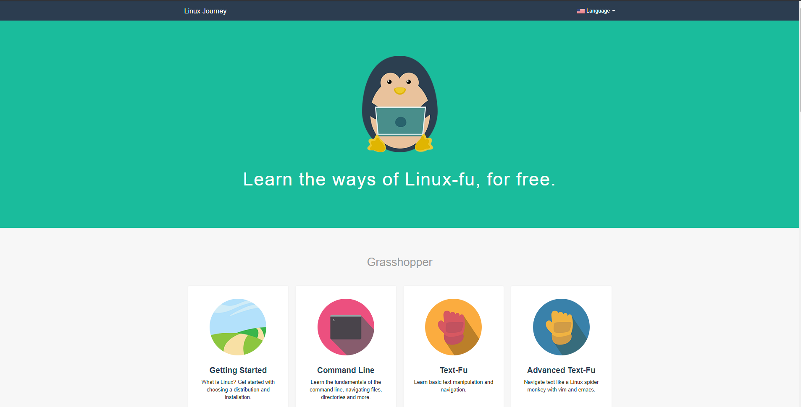

This is a dirty way to browse  [Linux Journey](https://linuxjourney.com) course, the way it was (only the english verison).

# Based on

* [Linux Journey](https://linuxjourney.com) is a site dedicated to making learning Linux fun and easy.

* [LunaGNUisance/linuxjourney](https://github.com/LunaGNUisance/linuxjourney) for ordering the content.

* [web.archive.org](https://web.archive.org/web/20220706072307/https://linuxjourney.com/) for copying the original site's styles


## Usage
```bash
pip install -r requirements.txt
cd src
uvicorn main:app
```
And...
